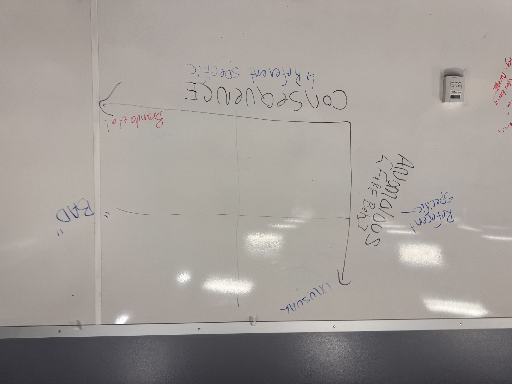

# Extreme Wildfire Workshop - Meeting 1 Notes

**Dates**: Monday, Sept 16th & Tuesday, Sept 17th    
**Times**: 9am - 3:30pm    
**Location**: CU Boulder SEEC Building    
**Facilitators**: Melissa Lucash, James Lamping    
**Attendees**: See introductions below  

## Daily Summaries

### Day 1: Introduction Day  
#### Goals:  
- Introduction to the workshop  
- Introduction to extreme wildfire  
- Identifying extreme wildfire research gaps  
- Discussion of research gaps

#### Welcome to the Extreme Wildfire Workshop (Melissa Lucash)  
- Thanks to attendees for coming to Boulder.  
- **Rationale for workshop**:    
  - Extreme events are increasing.  
  - They exhibit exceptional fire behavior and have severe consequences.  
  - Most current definitions focus on biophysical aspects, but we want to include other fields in defining extreme wildfire events (EWE).

- **What we want to accomplish**:  
  - **2-day**: Build an interdisciplinary team to synthesize our understanding of EWE, identify gaps, and create a roadmap for addressing them.  
  - **4-day**: Expand the team’s work and build a Docker package for LANDIS-II to run on high-performance computers.

- **Discussion of agenda**:    
  - James talked about his background and the importance of the workshop for modeling and wildfire.  
  - Rob introduced LANDIS and highlighted the need for social data and interdisciplinarity in fire modeling.  
  - Branda Nowell shared her background in disaster psychology and wildfire institutional response, with examples from a Gatlinburg wildfire.

#### General Introductions  

- **Ali Urza**: Research ecologist studying post-fire trajectories.  
- **Sean Parks**: Researches fire and climate relationships in Western US forests, focusing on high-severity fire.  
- **Courtney Shultz**: Focuses on policy barriers to fire and forest restoration collaboration post-fire.  
- **Cole**: Researcher at CSU, collaborates with Courtney.  
- **Amanda**: Works on models to inform emergency services, focusing on civilian-scale responses.  
- **Lise**: Wrangles messy human observations, connects daily incident reporting to burn parameters, and studies community responses.  
- **Wesley**: Master's student at UO studying vegetation changes in Alaska.  
- **Shelby Weiss**: Postdoc in Illinois researching future vegetation shifts due to fire in Alaska, working at Big Rivers Research Center.  
- **Jen Faucet**: Extension Forestry at NC State, working with a prescribed fire group for fuels management.  
- **Tirtha**: Assistant professor at UCI studying land/atmospheric interactions, weather/fire relationships, and prescribed fire collective leader.  
- **Matt**: Professor at UNM doing empirical field-based and modeling work.  
- **Zachary**: Postdoc at LANL working on a wide range of modeling topics.

#### Introduction to Extreme Wildfire  
- Melissa introduced the definition of EWE (Tedim et al. 2018) and contrasted it with "megafire".    
  Discussion followed, focusing on the societal threat and perception bias of "extreme" wildfires.

#### Breakout Rooms: Identifying Research Gaps

- **Biophysical Field**:    
  Major concepts included the exclusion of absolute thresholds from the definition and focusing on fire behaviors relative to historical regimes.  
    
- **Social Field**:    
  - Got stuck on definition. Whos the audience, what the model?
  - Talked about three things:
    - If what you want to know is it extreme for the ground crews? Is it extreme for ecology?
    - Extreme and its consequences. Ecology, community. 
    - Need to be explicit when you are setting up a model. 
  - Social data uses a lot of course grained data and messy data. Community value is messy: “Burning down a house may have a different social value than burning down a church”.
  - Disaster gets into another level of complexity
  - Discussion:
    - **(Melissa)** Depending on the audience you could have a different view of what may be extreme. 
    - **(Branda)** Extreme can start to get misused. Its absurd to not take into account what resources are available.notion of unprecedented (this is referential). are you asking if it is extreme for local unit response or for ecological recovery. Definition must be reworked based on this dependency. No model can capture it all therefore we must clarify context in modelling activities. How much outside of the distribution is the event? and what are the consequences?
    - **(Courtney)** It depends on what type of models are going to be used. If you are modeling what communities are at risk you need social inputs on things such as management and resources. you are missing something in characterizing the fire if you don't consider the socio ecological values especially as fires move through SE landscapes. From an operational standpoint who would it be useful for to have this definition?
    - **(Amanda)** Scale is something that is important to think about. The unpredictable behavior and spread is an odd choice, a fire-whirl may be an unpredictable behavior but may not be extreme unless it jumps a highway. What are the social impacts we measure? Earthquakes you can lose ~ 10% of your houses from an event but its “unacceptable” to lose even 1 house to fire. Also thinks that the control part of the definition is not capturing the dynamics.
    - **(Branda)** It seems to go on two axis, one is how far out of normal is a fire and two is how it impacts society/ecology
    - **(Rob)** extreme wildfire behavior vs extreme wildfire impacts

  - DISASTER:
    - **Amanda** Disaster for who disaster for what
    - **Branda** Stay away from it. Extreme in terms of unprecedented vs extreme in terms of consequence. Disaster is honing in on consequence
    Big switch to thinking about the two axes. Consequences and anomalous(fire behavior). These can be referenced to social or ecological systems. 
    - **Amanda** bad for ______ but good for __________ 
    - **Sean** anomalous implies bad for the ecosystem?
    

### Day 2: Building Off Day 1  
#### Goals:  
- Recap of Day 1.  
- Targeted group discussions addressing EWE research gaps.  
- Synthesis of discussions.  
- Publication planning.

#### Day 2 Overview  
- **Rob**: We are moving toward synthesis and paper preparation.  
- **Melissa**: Organized the gaps into seven themes. Groups will work on each theme, list research needs, and present findings.
- Notes for individual group can be found [here](link)

#### Group Discussions  
- Addressed how to tackle research needs and identified missing tools and resources.  
    
#### Publication Plan  
- Discussed whether to write a review or perspective piece.  
- **Possible journals**:    
  - Fire Ecology    
  - Nature Sustainability    
  - International Journal of Wildland Fire    
  - Frontiers in Environmental Engineering  

- **Title suggestion**: Roadmap for the Future of Extreme Fire Events (Rob).  
- Plan to have a draft ready by February, with regular check-ins and subgroup meetings to keep momentum.

## Additional Things  
### Action Items:  
- [ ] Specific task: Assigned to - Deadline  
- [ ] Specific task: Assigned to - Deadline

### Reflections and Comments:  
- (Space for any additional thoughts, insights, or personal reflections on the meeting.)

### Additional Documentation:  
- (Include or link to any additional documents, charts, or resources referenced during the meeting.)  
